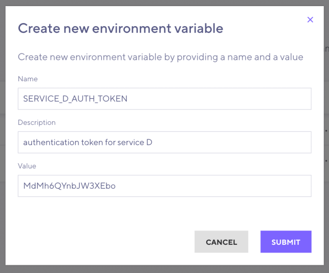

Environment Variables are key-value pairs configured at the organization level and can be used to store information that you want to reference in your cloud test-scripts across all projects of this organization. All values are encrypted at rest and their plain value can only be visible to the owner and admins of the organization. All members of the organization can reference the environment variables in their test scripts. 

> Changes to Environment Variables are not applied to already started Test Runs, they only apply to new upcoming Test Runs.

### Manage environment variable

Environment Variables can be managed in Organization Settings: Select your profile icon, then **Manage > Environment variable**. Permission to create, reveal, modify and delete environment variables is restricted to Owners and Admins of the organization. 

#### Declare new environment variable

Enter the Name for your Environment Variable. Then, enter the respective Value. Optionally, you can also add a brief description then click **submit**. 

> The cloud Environment Variable can be referenced in the [script-edictor](https://k6.io/docs/cloud/creating-and-running-a-test/script-editor/) through the global `__ENV` variable, the same way as in [k6 CLI Environment Variable](https://k6.io/docs/using-k6/environment-variables/#passing-environment-variables-to-the-k6-script)

#### Order of priority

If a load test is started with `k6 cloud` command and have set environment variable from the command line, this data will be available in the archive metadata as plain data. In this case the environment variable set from the command line have a higher priority and will override the environement variable set via the cloud app when running the tests.
