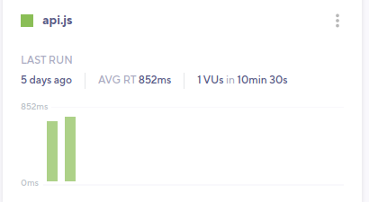

k6 Cloud Results visualizes, stores, analyzes, and presents trends for your test results.
For all tests that use k6 Clouds Results, [Performance Insights](/cloud/analyzing-results/performance-insights/) algorithms analyze the script and results to promote good practices and detect patterns associated with performance issues.

As you use k6 Cloud Results, k6 automatically creates trending graphs that track your system performance over time.
These graphs help you identify creeping performance issues before they become serious.

## Navigate tests and metadata

k6 tracks runs of a test script over time.
If you want to inspect trends for a test script, follow these steps:

1. Go to **Projects** and select the project that holds the tests.
2. Select or search for the test you want. A test with multiple runs will have at least two bars in its histogram:

3. Now, select a bar to inspect a single run.

  Each test has metadata, which includes the person who started the test, and its status, duration, VUs, and regions.
  

To rerun, share, compare, or configure the test, use the buttons to the right.

To navigate back and forth between a project, a top-level test page, and a run, you can also use the breadcrumb menu:

## Performance Overview

The **Performance Overview** section displays high-level data for your test.
While the test runs, it displays live metrics.

After the test finishes, the section stops showing stats that are relevant only while monitoring a live test.

If a test script has any scenarios, the main performance-overview chart shows a report with high-level data for scenario.

k6 highlights any issues that the Performance Insights algorithms detect.
In this test, our algorithms did not find any problems:

### Indicators of good and bad results

The first sign of a good or bad result is usually in the **Performance Overview** panel.

Typical signs of a good result:

- Response time has a flat trend for the duration of the test
- Request rates follow the same ramping pattern as Virtual Users (if VUs increase, so does the request rate)

Typical signs of a performance issue or bottleneck:

- Response times rise during the test
- Response times rise, then quickly bottom out and stay flat
- Request rates do not rise with VUs (and response times start to increase)

This is a non-exhaustive list. You should use these patterns as a first indicator of good or bad performance of your test.

## Scenarios

The **Scenarios** section shows high-level data for the individual scenarios configured in the test script.
The overview data is grouped per protocol to make comparison and analysis easier.
This test was configured to generate traffic using HTTP, WebSocket and gRPC.

## Result Tabs

In the **Results** tab, you can dig into the specific result data sets from your test.

| Tab Name   | Definition                                                                                     | Add to analysis? | Filtering        | Sorting                 |
| ---------- | ---------------------------------------------------------------------------------------------- | ---------------- | ---------------- | ----------------------- |
| Thresholds | List of your Thresholds in the order they are defined in your script (if used).                | Yes              | Yes              | In order defined        |
| Checks     | List of Checks, organized into Groups (if used).                                               | Yes              | Yes              | By scenario/group, or list (all) |
| HTTP       | List of HTTP requests made, organized into Groups (if used).                                   | Yes              | Yes              | By scenario/group, or list (all) |
| WebSocket  | List of Websocket requests made, organized into groups (if used).                              | Yes              | Yes              | By scenario/group, or list (all) |
| gRPC       | List of invoked gRPC methods, organized into groups (if used).                                 | Yes              | Yes              | By scenario/group, or list (all) |
| Analysis   | Tab used to compare data for analysis                                                          | N/A              | N/A              | N/A                     |
| Script     | Script used to run your test (k6 cloud tests only)                                             | N/A              | N/A              | N/A                     |
| Logs       | Logs that were generated by test script (see [docs for logs](/cloud/analyzing-results/logs/))  | N/A              | Yes              | N/A                     |

With these tabs, you can visually explore your test data and errors.
Select any metric to expand a graph and dig deeper.

You can also add these graphs to the **Analysis** tab.
This allows you to look for interesting correlations in your result data.
Within each tab, note the &#10003; or &#10005; next to the individual metrics if failures were encountered.
In the example below, we have two checks with apparent failures.

## Analysis

In the **Analysis** tab, you can analyze and compare metrics.
This helps you view specific pieces of your data and find correlations.
Added metrics first appear as a small chart.
To visualize the data in different ways, you have a few choices:
- Change your aggregation
- Select **Filters**.
- Use the `+` to add the data to the large chart for comparison.

## See Also

- [Performance Insights](/cloud/analyzing-results/performance-insights/)
- [Thresholds](/cloud/analyzing-results/thresholds)
- [Checks](/cloud/analyzing-results/checks)
- [HTTP Table](/cloud/analyzing-results/http)
- [Analysis and Comparison Tab](/cloud/analyzing-results/test-comparison)

