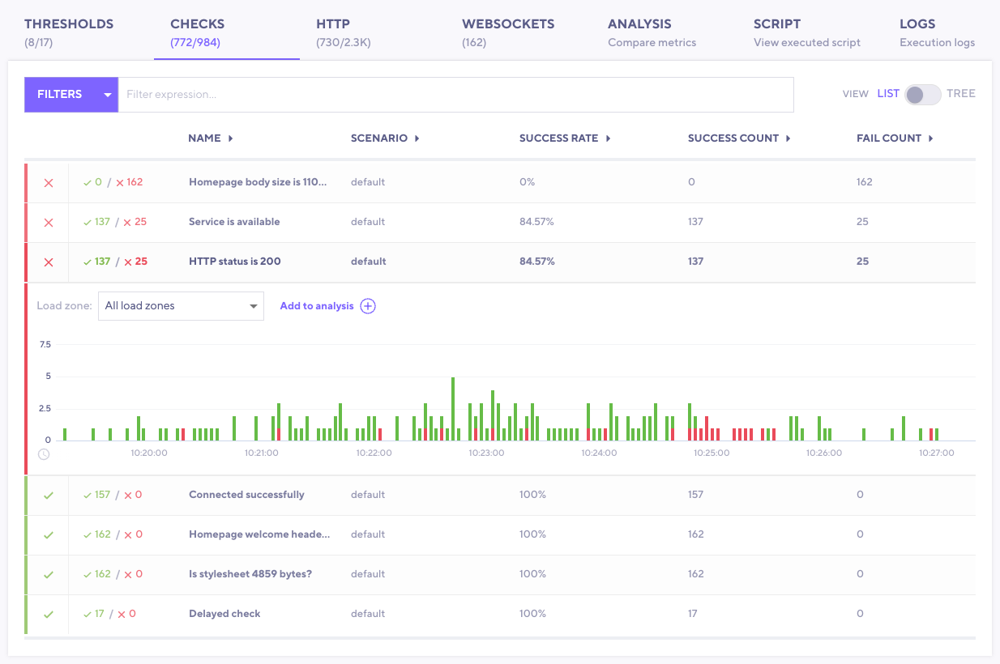

Whereas thresholds validate your metrics, *checks* validate response values.
For example, you can use checks to validate that your POST request is returning `201` status codes.

Inspecting checks is a valuable practice at both the beginning and the end of the test.
- If your checks fail at the beginning, there's a good chance the test is sending improper requests.
  For example, `4xx` responses to POST requests may indicate that the authentication is malformed.
- If your checks fail at the beginning, there's a good chance that the system is degrading under the test load.

To visually inspect and analyze your checks, you can use the **Checks** tab.
First, in the tab itself, note the number of checks that passed against the total number of checks.
This provides a quick, top-level overview of the check performance.

From there, you can explore the individual checks.

## Explore checks in cloud results

In the **Checks** tab, you can do the following:

- Find `Checks` that have failures. Note the &#10003; or &#10005; on the left side of each row.
  - In the preeding image, the Check `HTTP status is 200` succeeded only 84.57% of the time: 137 successful runs and 25 failures.

- To view a graph for a check, select the check.

  With the graph, you can see how many failures occur at different points in the test

To compare the check data with other data about the test:
1. Select a check.
1. Select **Add to Analysis**.
1. Then use the **Analysis** tab to find correlations between checks data and other values from the test.
  

## See Also

For more information on using checks in your test, refer to the [Checks documentation](/using-k6/checks).
