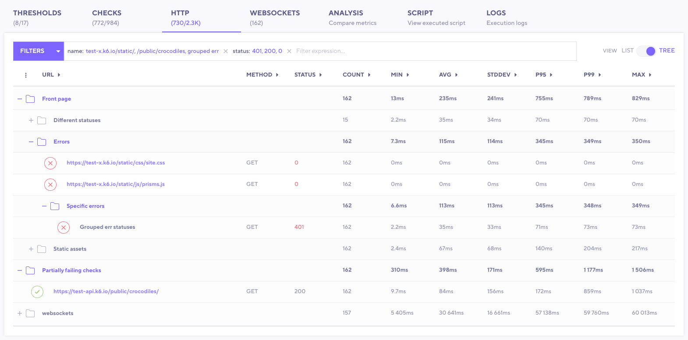

If your test is on an HTTP service, you'll often want to search through the requests that the test made to find significant values.

In k6 Cloud, you can use the **HTTP** tab to inspect individual requests in your test.

First, in the tab itself, note the number of HTTP requests that passed against the total number of requests.
This number provides a quick, top-level overview of test performance.

Then, you can explore the individual requests.

## Explore HTTP requests in cloud results

The **HTTP** tab shows a row for each HTTP request, with columns for resource, test scenario, method used, and status code returned.

If an endpoint has multiple request methods or status codes, k6 separates them.
The data in each row helps you quickly scan for failed HTTP requests. Take notice of the &#10003; on the left of each row. If they were failures, they would be marked with a &#10005;

To filter the requests to a subset of requests, use the search bar to filter by `name`, `status`, etc.
These filters can be particularly useful when analyzing the result.

To inspect a request in detail, select its row.
This expands the request, so you can see:

- Additional metrics for the request
- Options to change the aggregation
- To see HTTP metrics from a specific load zone, use the drop down.

To compare the request, and its metrics, with other data about the test:
1. Select the row.
2. Select **Add to analysis**.
3. Then use the **Analysis** tab to find correlations between threshold data and other values from the test.

### Organize HTTP requests by scenario and group

The HTTP tab can  display two different views:
- The list view shows a flat list of entries. You can use the columns to sort by label name, status, method, and expected_response.
- The tree view organizes entries by the scenario and group from which the request was sent.

To change the tab to tree view, use the toggle.

To sort trees by a metric, select the caret at the top of the column.

To explore a specific node for a scenario or group, uncollapse the resource.

To customize what metrics and resources are displayed, use the vertical-ellipses (or "kebab") icon at the beginning of the heading row.
With this icon, you hide columns or show new columns.

