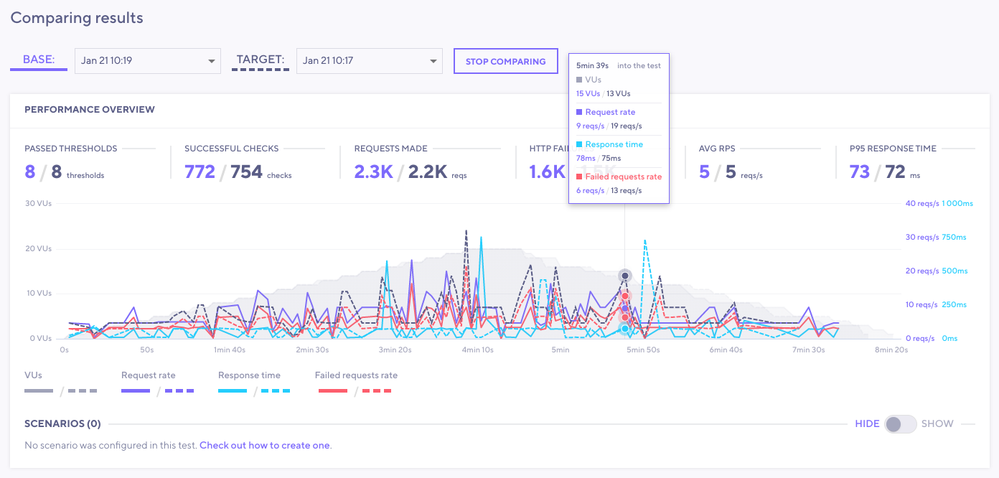
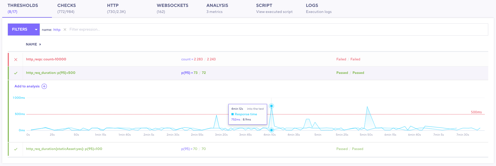
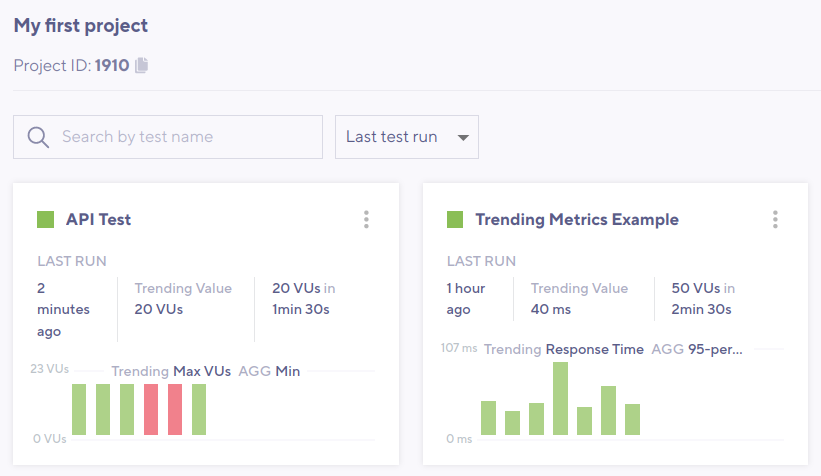
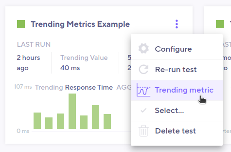
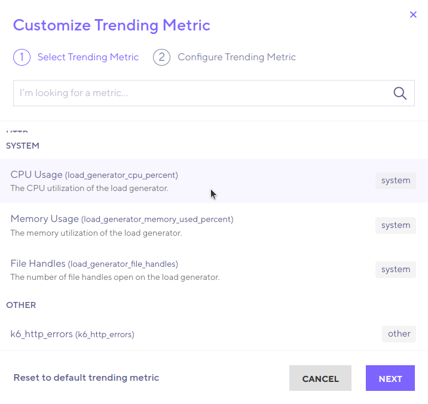
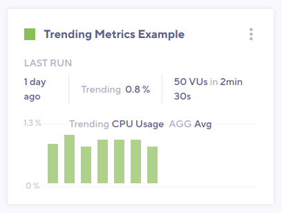

To find regressions, you can compare data from multiple test runs.
k6 Cloud provides three graphical ways to compare tests over time:

- Between a recent run and a baseline
- Between two selected runs
- Across all runs for a certain script

<Blockquote mod="warning">

**Test comparison works only on runs from the same test script**

You can't compare two different test scripts.

</Blockquote>

## Use a test as a baseline

Comparing results against a known *baseline* is a core part of the general methodology for [automated performance testing](/testing-guides/automated-performance-testing).
Baseline tests are important for comparing against a control and finding differences.

Baseline tests should produce enough load to contain meaningful data and ideal results.
In other words, a heavy [stress test](/test-types/stress-testing) isn't a good baseline.
Think much smaller.

To set your baseline, follow these steps:

1. Open the results for the test run you wish to be your baseline.
2. Select the three dots in the top right corner, then **set as Baseline**.

Baseline tests are exempt from [data-retention policies](/cloud/your-plan/about-data-retention/).

## Select test runs to compare

To compare two test runs, follow these steps:

1. Open up a test run.
2. In the top right, select **Compare result**.
3. Select the test run you want to compare the test to.

## Test comparison mode

When you compare tests, the layout of the performance-overview section changes to *comparison mode*.
Comparison mode has controls for changing base and target tests,
and the overview chart now renders time series for the two compared test runs.

Solid lines represent the base run, and dashed lines represent the comparison.
To make a certain time series more visible, select the appropriate element in the interactive legend.

### Compare scenarios

If a test has multiple scenarios, k6 presents a performance overview for each one.
If the test script uses multiple protocols, k6 categorizes the overview data by protocol.

### Compare thresholds

To compare thresholds, select the **Thresholds** tab.
You can add additional data to the table for the base and target test runs.

You can compare the following threshold data from the current and previous runs:
- The `value` of the threshold
- `pass/fail` statuses
- Previous and current test-run values for each threshold and its `pass/fail` status.

To display a separate threshold chart for each test run, select a threshold.

### Compare checks

To compare checks, use the **Checks** tab.
Here, k6 provides extra data on the table for the base and target test runs.

You can compare the following metrics from the current and previous runs:
- `Success Rate`
- `Success Count`
- `Fail Count` 

To display separate check charts for each test run, select a check.

### Compare HTTP requests

To compare HTTP requests, use the **HTTP** tab.
Here, k6 provides extra data on the table for the base and target test runs.

You can compare the following data from the current and previous runs:
- Metrics such as:
  - `request count`
  - `avg`
  - `p95 response time`
- Other data for individual HTTP requests.

To show separate charts, select the rows for each test run that you want to compare.
You can add extra charts, such as timing breakdowns for each HTTP request.

## Compare all runs for a test

To compare runs for a test across time, use the *performance-trending chart*.
The chart displays test-run metrics, using colors to signal the status of a specific run.

To view the performance-trending chart for multiple tests that belong to the same project, open the **Project** page:

Additionally, to view the performance-trending chart for an individual test, open the test's page:

This last chart shows more data points over time. For more information about an individual run, hover over any bar in the chart.

By default, the data displayed in the performance-trending chart is the `p95` of the HTTP response time (`http_req_time`).

The chart displays a summary _trending metric_, an aggregated value for all metric data points in the test run.
k6 produces a single value for each test run using the trending metric, and then plots each value the chart.
You can customize the trending metric on a per-test basis.

### Customize the trending metric 

To customize the trending metric used for a test:

1. Navigate to the Project page.
2. Select the three dots at the top-right corner of the test's performance-trending chart.
3. Select **Trending metric**.

This brings up a window:

From the window, you can select the metric to use in the performance-trending chart.
Note that both standard (created by all k6 test runs) and custom (user-defined) metrics are listed.
This example selects `CPU Usage`:

After you select a metric, you can select:
- The aggregation function to apply to the metric (in this case, "Average" is selected).
- A set of tags & tag values used to filter the metric's values (in this case, selecting values only from instances in the `amazon:us:ashburn` load zone).

To reset the configuration, use the default trending metric with **Reset to default trending metric**.

After you select the desired parameters, **Save** to apply the changes. k6 calculates the required values, then plots them in the performance-trending chart.
In this example, the results look like this:

