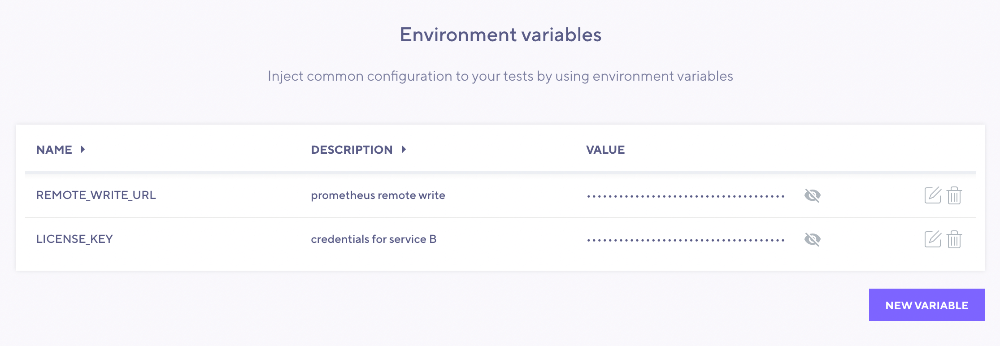

Environment Variables are key-value pairs configured at the organization level. All values are encrypted before being stored in our database and remain encrypted until they are needed for test-runs. You reference environment variables within a test-script and the variables are interpolated on the server that runs the Test-Run. Environment Variables can be used to store sensitive (and non-sensitive) information that you want to reference in your test-scripts. Managing environment variables in one central place reduces the data exposure and ensures that the changes take effect in all test-runs that use these variables.

> Changes to an Environment Variable won't apply to already started Test-Runs, they only apply to new upcoming Test-Runs.

## Managing environment variables

Environment Variables can be managed in Organization Settings: Select your profile icon, then **Manage > Environment variables**. Permission to create, reveal, modify and delete environment variables is restricted to Owners and Admins of the organization. 



#### Naming environment variables

The following rules must apply for naming an environment variable:
- Names can only contain alphanumeric characters (`[a-z]`, `[A-Z]`, `[0-9]`) or underscores (`_`). Spaces are not allowed.
- Names must not start with the `K6_CLOUD` prefix.
- Names must not start with a number.
- Names are not case-sensitive.
- Names must be unique.

#### Declaring a new environment variable

Enter the Name for your Environment Variable. Then, enter the respective Value. Optionally, you can also add a brief description then click **submit**. 


## Accessing environment variables

Environment Variables set up on the cloud can be referenced in your k6 script through the __ENV variable, like other [k6 Environment Variables](https://k6.io/docs/using-k6/environment-variables/#passing-environment-variables-to-the-k6-script)

```javascript
import http from 'k6/http';
import { sleep } from 'k6';

export default function () {
  const params = {
    headers: { Authorization: __ENV.AUTH_TOKEN },
  };
  const res = http.get(__ENV.SERVICE_URL, params);
  sleep(1);
}
```

<Blockquote mod="warning">
The current environment variables implementation doesn't prevent printing values to the log (or restrict exposing a variable any other way). You should avoid printing sensitive data to the log intentionally.
</Blockquote>

## Running tests with k6 cloud command

Environment variables set up on the cloud can be referenced on test runs run with `k6 cloud` command. 

### Limitations

Referencing environment variables set in the cloud app in local scripts is possible, but it doesn't work in all cases. If the code in the [init context](https://k6.io/docs/getting-started/running-k6#the-init-context-and-the-default-function) depends on the value of the environment variable, the test run may fail.

In the example below, the `JSON.parse` expects a valid JSON. If the `MY_HEADERS` is not set via CLI flag `--env`, the value will be `undefined` and the test will fail locally and throw an exception:

```javascript
import http from 'k6/http';
import { sleep } from 'k6';

const headers = JSON.parse(__ENV.MY_HEADERS); // throws an exception

export default function () {
  headers['Authorization'] = `Token ${__ENV.AUTH_TOKEN}`;
  const res = http.get(__ENV.SERVICE_URL, { headers });
  sleep(1);
}
```

But if the value of `__ENV.MY_HEADERS` is first accessed in the default function, the test run will be successfully sent to the cloud and if the value is correctly set in the cloud, the test run will succeed. (This is also valid for the `setup()` and `teardown()` functions):

```javascript
import http from 'k6/http';
import { sleep } from 'k6';

export default function () {
  const headers = JSON.parse(__ENV.MY_HEADERS);
  headers['Authorization'] = `Token ${__ENV.AUTH_TOKEN}`;
  const res = http.get(__ENV.SERVICE_URL, { headers });
  sleep(1);
}
```

### Order of precedence

When starting tests with `k6 cloud`, environment variables set via CLI flag `--env` and environment variables set in the cloud are combined and used together to run the test. If an environment variable is both set via CLI and declared in the cloud, the value set via the CLI will be applied instead of the value set in the cloud.

<Blockquote mod="warning">
Environment variables set via CLI flag will still be stored in the archive as plain data.
</Blockquote>
